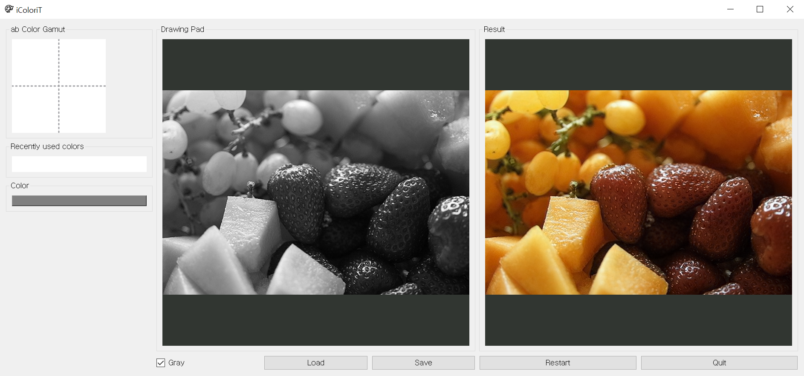

# iColoriT Demo Software 🎨

We provide a GUI which can run on CPU-only devices as well as devices with a GPU. 

Try out iColoriT with your own images and color hints! 

<p align="center">
  
</p>

## Pretrained iColoriT

Checkpoints for iColoriT models are available in the links below.

|  	| Backbone 	| Link 	|
|:---:	|:---:	|:---:	|
| iColoriT	| ViT-B 	| [iColoriT (Google Drive)](https://drive.google.com/file/d/16i9ulB4VRbFLbLlAa7UjIQR6J334BeKW/view?usp=sharing)	|
| iColoriT-S 	| ViT-S 	| [iColoriT-S (Google Drive)](https://drive.google.com/file/d/1yKwFTQGDBvr9B7NIyXhxQH0K-BNlCs4L/view?usp=sharing) 	|
| iColoriT-T 	| ViT-Ti 	| [iColoriT-T (Google Drive)](https://drive.google.com/file/d/1GMmjfxAoM95cABwlZD8555WxI7nmIZrR/view?usp=sharing)	|


## Installation

Our code is implemented in Python 3.8, torch>=1.8.2, and PyQt5
```
git clone https://github.com/pmh9960/iColoriT.git
pip install -r requirements.txt
```

## Run iColoriT

Once you have satisfied all the requirements, you can run the base iColoriT model by executing

```
python3 icolorit_ui.py --model_path <path/to/checkpoint> --target_image <path/to/image>
```


<p align="center">
  
</p>

### Controls

<ul>

<li> Left click on Drawing Pad to select the hint location. 

<li> Left click on the ab Color Gamut to select a color.

<li> Right click on a hint location to undo the click.

<li> Press <em>Restart</em> to undo all hints. 

<li> Press <em>Save</em> to save the colorized image. 

<li> Press <em>Load</em> to load another image.

</ul>

## Acknowledgments

Our GUI is an updated version of the [interactive-deep-colorization](https://github.com/junyanz/interactive-deep-colorization).
Thanks for sharing the codes!
